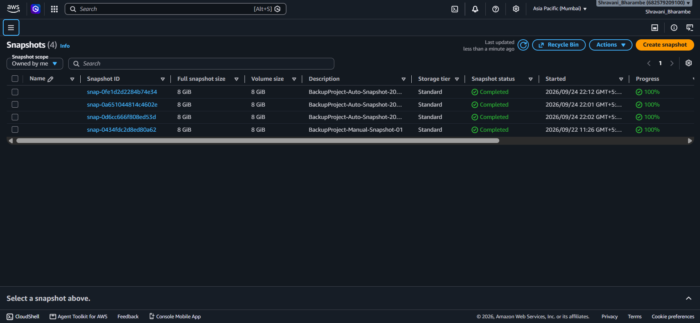
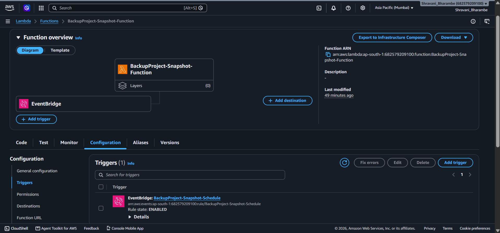
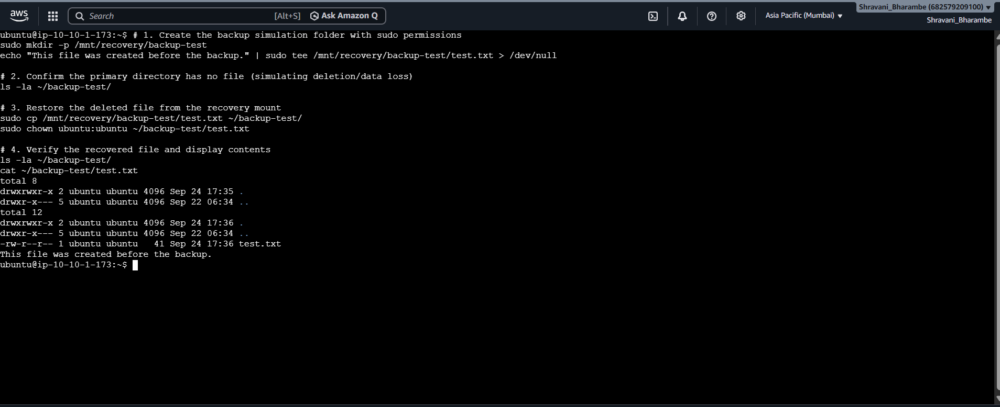

# AWS Backup & Recovery System

An automated AWS backup and recovery system for EC2 data using **Amazon EBS Snapshots, AWS Lambda, IAM, and scheduled automation**.

---

## 📌 Overview

This project demonstrates how cloud infrastructure can be automated to protect data from accidental deletion, corruption, or infrastructure failure.

The system automatically creates **EBS snapshots** of an EC2 instance's attached volume, maintains a defined retention limit, and deletes older snapshots automatically.

The project was built to gain hands-on experience with **AWS compute, storage, serverless automation, IAM, and backup/recovery workflows**.

---

## 🎯 Problem Statement

Manual backups can be inconsistent and difficult to maintain.

This project addresses that problem by automating the backup process:

* Automatically create EBS snapshots
* Apply metadata tags to backups
* Maintain a fixed retention limit
* Automatically remove older snapshots
* Provide a recovery mechanism using stored snapshots

---

## 🏗️ Architecture


### Architecture Flow

```text
Amazon EC2
     │
     ▼
Amazon EBS Volume
     │
     │
     ▼
AWS Lambda
     │
     ├── Create EBS Snapshot
     │
     ├── Tag Snapshot
     │
     ├── Check Existing Backups
     │
     └── Delete Older Snapshots
     │
     ▼
EBS Snapshot Backup
     │
     ▼
Recovery when required
```

---

## ☁️ AWS Services Used

| AWS Service            | Purpose                                                   |
| ---------------------- | --------------------------------------------------------- |
| **Amazon EC2**         | Hosts the test environment and provides compute resources |
| **Amazon EBS**         | Provides persistent block storage attached to EC2         |
| **EBS Snapshots**      | Stores point-in-time backups of the EBS volume            |
| **AWS Lambda**         | Automates snapshot creation and retention management      |
| **Amazon EventBridge** | Used for scheduled automation                             |
| **AWS IAM**            | Controls permissions required by the Lambda function      |

---

## ⚙️ How It Works

### 1. EC2 & EBS

An EC2 instance is configured with an attached EBS volume containing test data.

The EBS volume acts as the persistent storage that needs to be backed up.

### 2. Scheduled Automation

A scheduled automation trigger invokes the Lambda function.

This removes the need to manually create backups.

### 3. Snapshot Creation

The Lambda function uses the AWS SDK for Python (`boto3`) to create an EBS snapshot of the configured volume.

Each snapshot receives metadata tags such as:

```text
Project = BackupProject
BackupType = Automated
CreatedAt = <timestamp>
```

### 4. Retention Management

The Lambda function checks existing automated snapshots and sorts them by creation time.

The system maintains the **3 most recent snapshots**.

Older snapshots beyond the retention limit are automatically deleted.

```text
Latest Snapshot     → Keep
2nd Latest          → Keep
3rd Latest          → Keep
Older Snapshots     → Delete
```

### 5. Recovery

If the original EBS volume needs to be restored, an EBS snapshot can be used to create a new volume and recover the stored data.

---

## 💻 Lambda Implementation

The backup automation is implemented using Python and `boto3`.

Key functionality includes:

* Creating EBS snapshots
* Timestamp-based snapshot descriptions
* Snapshot tagging
* Querying automated snapshots
* Sorting snapshots by creation time
* Enforcing a retention limit
* Automatically deleting older snapshots

The EBS volume ID is configured through a **Lambda environment variable** rather than being hard-coded into the source code.

Source code:

[`lambda/backup_lambda.py`](lambda/backup_lambda.py)

---

## 🧪 Testing & Validation

### Backup Snapshot



Verified that the Lambda function successfully creates an EBS snapshot of the configured volume.

### Automation



Verified the automated backup workflow and Lambda execution.

### Recovery Validation



Validated the recovery process using the generated EBS snapshot and confirmed that the backed-up data could be restored.

---

## 🔐 Security Considerations

* IAM permissions are used to control Lambda access to EC2/EBS resources.
* The EBS volume ID is stored as a Lambda environment variable.
* No AWS access keys or secret credentials are stored in the repository.
* IAM permissions should follow the **principle of least privilege**.
* Sensitive AWS credentials and private key files are never committed to GitHub.

---

## 💰 Cost Considerations

The project uses AWS resources that may incur charges depending on usage.

The main potential costs are associated with:

* EC2 instance usage
* EBS storage
* EBS snapshots
* Lambda executions

For learning environments, unused resources should be stopped or deleted when they are no longer required.

---

## 📚 Key Learnings

Through this project, I gained practical experience with:

* Amazon EC2
* Amazon EBS
* EBS Snapshots
* AWS Lambda
* AWS IAM
* Amazon EventBridge
* `boto3`
* Serverless automation
* Backup retention strategies
* Cloud storage and recovery concepts
* Testing and validating cloud infrastructure
* Designing automated operational workflows

---

## 🚀 Future Improvements

Possible future enhancements include:

* **Amazon SNS** notifications for backup failures and successes
* **Amazon CloudWatch** monitoring and alarms
* Configurable retention periods
* Backup status reporting
* Cross-region snapshot replication
* Infrastructure as Code using **Terraform or AWS CloudFormation**
* Backup verification and automated recovery testing

---

## 📁 Repository Structure

```text
aws-backup-recovery-system/
│
├── README.md
├── 01-infrastructure.png
├── 02-backup-snapshot.png
├── 03-automation.png
├── 04-recovery-validation.png
│
└── lambda/
    └── backup_lambda.py
```

---

## ✅ Project Status

**Completed and tested successfully.**

The project demonstrates an automated AWS backup workflow with snapshot creation, retention management, scheduled automation, and recovery validation.

---

## 👩‍💻 Author

**Shravani Bharambe**

Computer Science Student | Cloud & DevOps Enthusiast

Focused on building practical projects with **AWS, Cloud Infrastructure, Networking, Linux, and DevOps technologies**.
